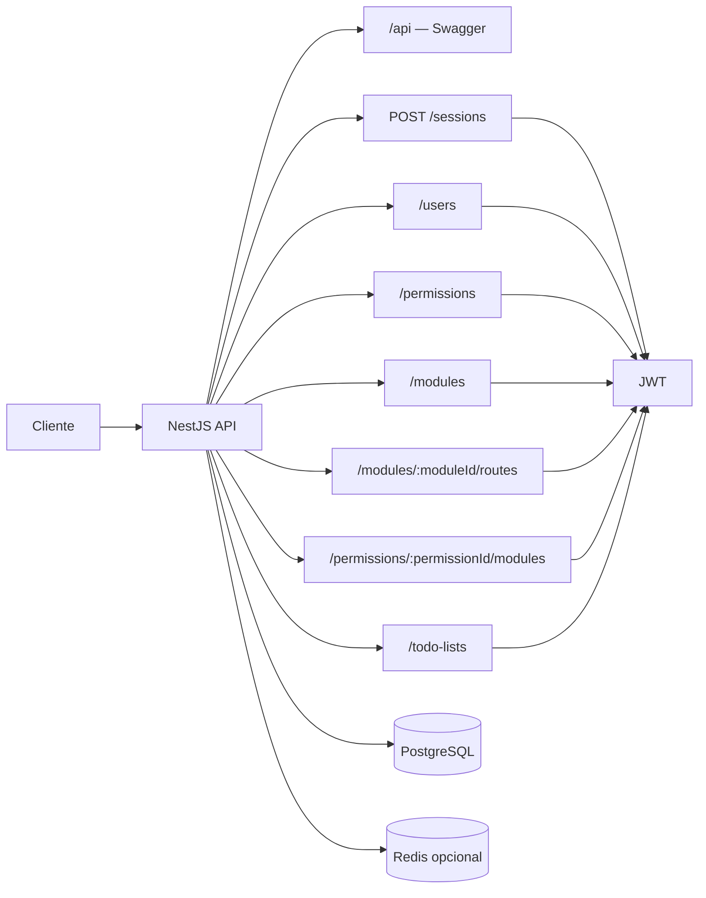
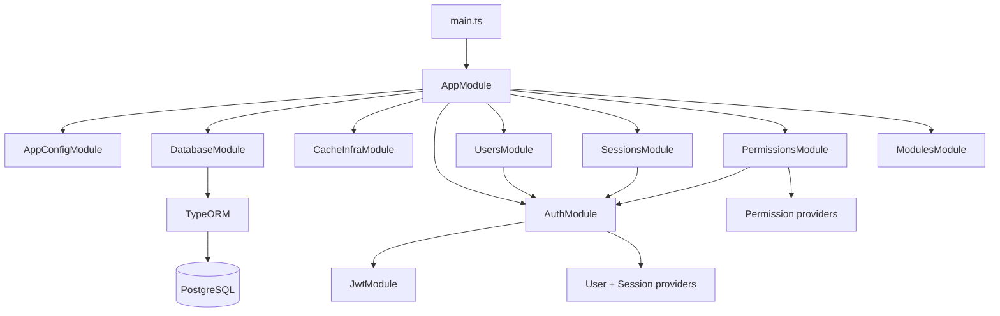
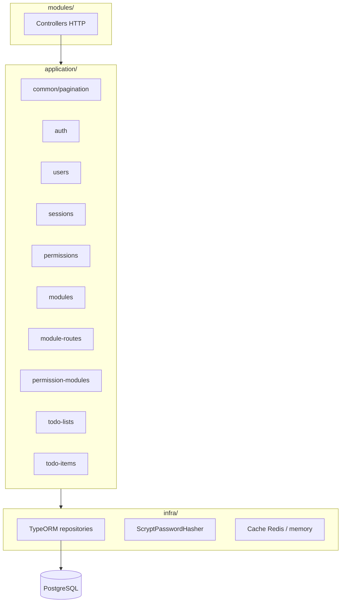
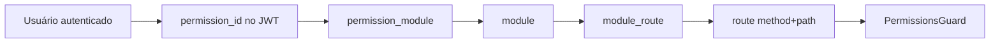

# Diagrama de arquitetura

Visão geral da `permissions.api`.

## Fluxo HTTP

## Módulos Nest

## Camadas

## Contextos de domínio

| Contexto | Service | Rotas |
|----------|---------|-------|
| `sessions` | `SessionService` | `POST /sessions` |
| `users` | `UserService` | `/users` |
| `permissions` | `PermissionService` | `/permissions` |
| `modules` | `ModuleService` | `/modules` |
| `module-routes` | `ModuleRoutesService` | `/modules/:moduleId/routes` |
| `permission-modules` | `PermissionModulesService` | `/permissions/:permissionId/modules` |
| `todo-lists` | `TodoListService` | `/todo-lists` |
| `todo-items` | `TodoItemService` | `/todo-lists/:listId/items` |

Listagens paginadas (`GET` em coleções) usam `common/pagination` para query params e envelope `{ data, meta }`.

`AuthModule` concentra JWT, `JwtAuthGuard`, `PasswordHasher` e repositório de usuários usado no login.

## Infraestrutura de dados

- Entities: `module`, `route`, `permission`, `user`, `module_route`, `permission_module`, `todo_list`, `todo_item`
- Migrations via TypeORM CLI (`data-source.ts`)
- Logs do ORM desabilitados (`logging: false`)
- `synchronize: false` — schema apenas via migrations

## Scripts e CLI

- `scripts/generate-migration.ts` — wrapper para gerar migrations
- `pnpm run start:dev` — Nest watch (SWC) + `tsc-alias` para path aliases

## Modelo de autorização

`module` representa um bloco funcional do front (página, botão, componente, seção etc).  
Se a permissão do usuário estiver vinculada a um ou mais módulos, ele acessa todas as rotas associadas a esses módulos.
