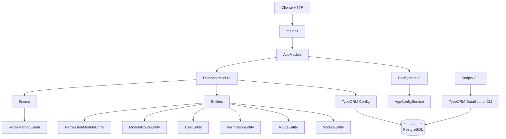

# Diagrama de Arquitetura

Visao geral da estrutura atual da `permissions.api`.

## Observacoes

- O modulo de configuracao concentra leitura e validacao das variaveis de ambiente.
- O modulo de banco encapsula configuracao do TypeORM, mapeamento das entidades e enums de persistencia.
- A geracao de migrations usa script em `scripts/` e um `data-source` dedicado para o TypeORM CLI.
- As entidades representam tabelas base (`module`, `route`, `permission`, `user`) e tabelas de associacao (`module_route`, `permission_module`).
