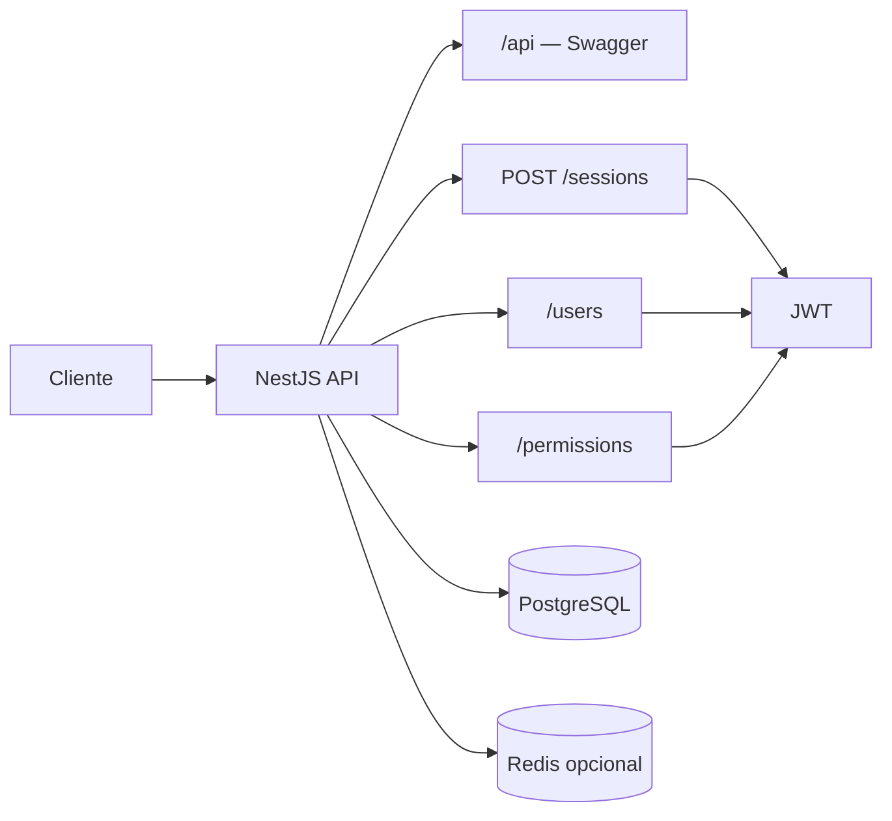
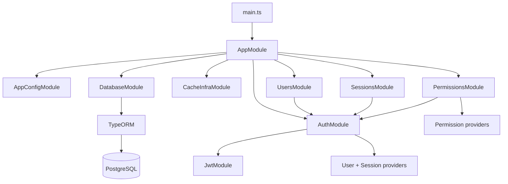
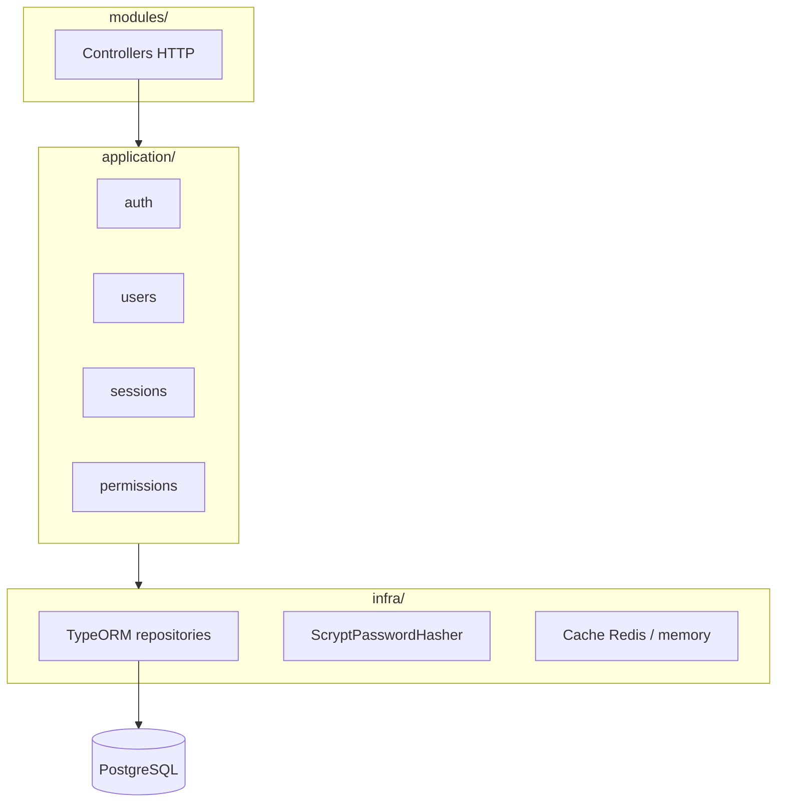

# Diagrama de arquitetura

Visão geral da `permissions.api`.

## Fluxo HTTP

## Módulos Nest

## Camadas

## Contextos de domínio

| Contexto | Service | Rotas |
|----------|---------|-------|
| `sessions` | `SessionService` | `POST /sessions` |
| `users` | `UserService` | `/users` |
| `permissions` | `PermissionService` | `/permissions` |

`AuthModule` concentra JWT, `JwtAuthGuard`, `PasswordHasher` e repositório de usuários usado no login.

## Infraestrutura de dados

- Entities: `module`, `route`, `permission`, `user`, `module_route`, `permission_module`
- Migrations via TypeORM CLI (`data-source.ts`)
- Logs do ORM desabilitados (`logging: false`)
- `synchronize: false` — schema apenas via migrations

## Scripts e CLI

- `scripts/generate-migration.ts` — wrapper para gerar migrations
- `pnpm run start:dev` — Nest watch (SWC) + `tsc-alias` para path aliases
