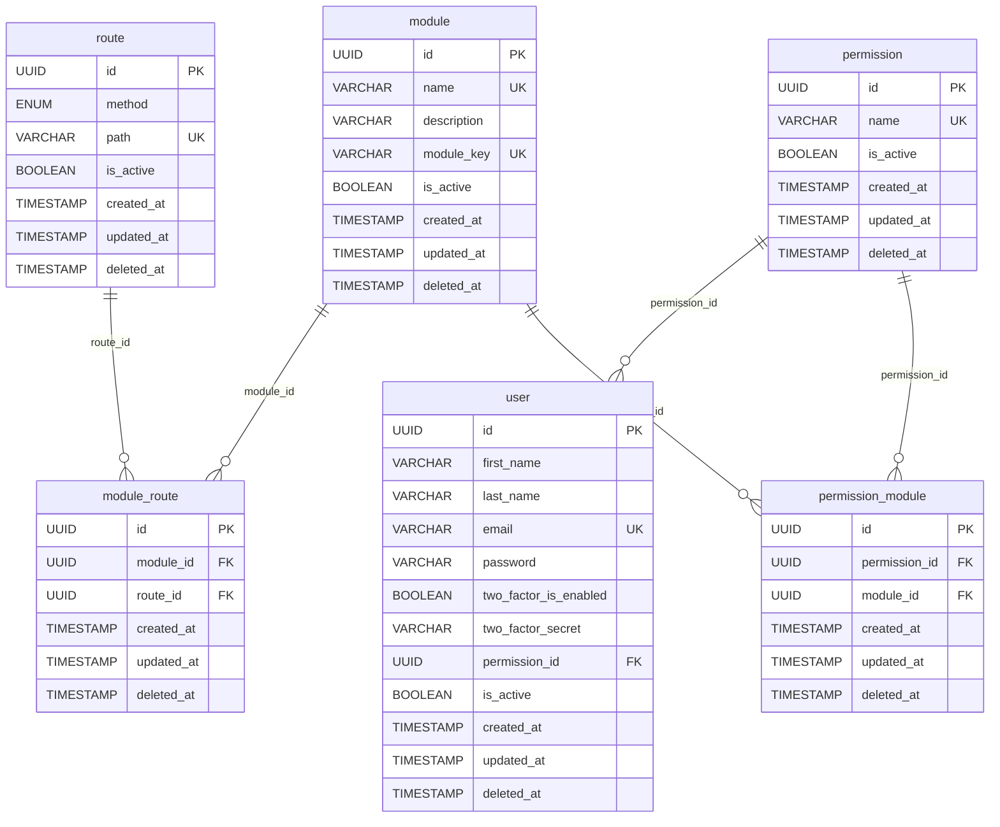

# Diagrama PostgreSQL (ERD)

Modelo atual do banco PostgreSQL com base nas entidades mapeadas via TypeORM.

## Observacoes

- Todas as tabelas usam `id` como chave primaria (`uuid` gerado automaticamente).
- Campos `deleted_at` indicam soft delete quando preenchidos.
- `route.method` usa enum `RouteMethodEnum` (`GET`, `POST`, `PUT`, `PATCH`, `DELETE`, `OPTIONS`, `HEAD`).
