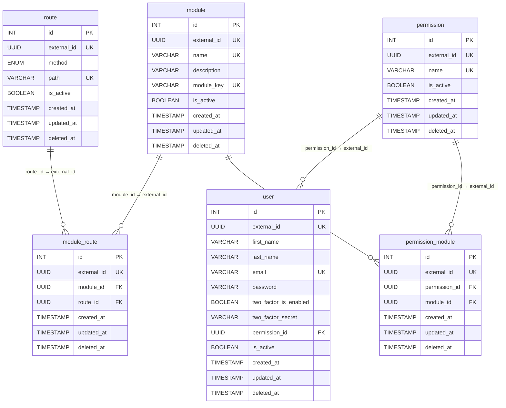

# Diagrama PostgreSQL (ERD)

Modelo relacional com base nas entities TypeORM. Todas as tabelas de domínio estendem `BaseEntity`:

- `id` — `SERIAL` (PK interna)
- `external_id` — `UUID` (identificador exposto na API)

## Observações

- **Soft delete:** `deleted_at` preenchido indica registro removido logicamente.
- **`route.method`:** enum `RouteMethodEnum` (`GET`, `POST`, `PUT`, `PATCH`, `DELETE`, `OPTIONS`, `HEAD`).
- **FKs na API:** referências usam `external_id` (UUID), não o `id` serial.
- **Usuário / 2FA:** `two_factor_secret` é gerado pelo servidor (`otplib`) quando `two_factor_is_enabled` é `true`; não é enviado nem exposto em respostas JSON.
- **Módulos e rotas:** entities mapeadas; endpoints HTTP para `module` / `route` ainda não implementados.

## Migration inicial

`1778701122908-initial_migration.ts` — cria o schema acima com extensão `uuid-ossp`.
